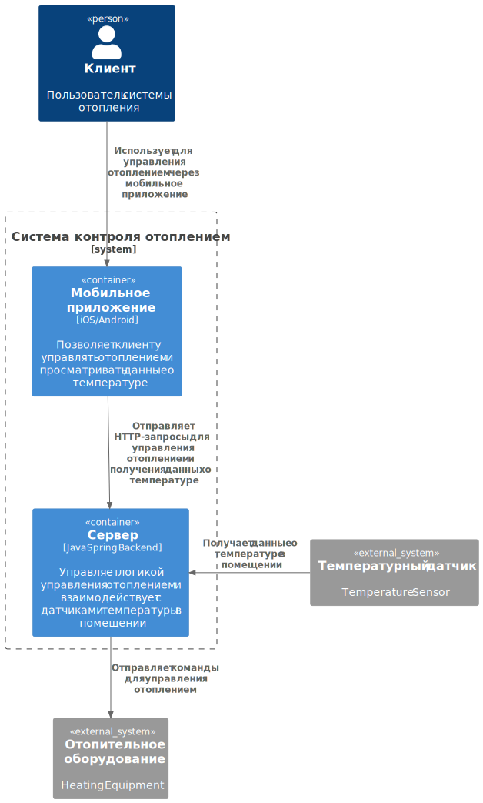
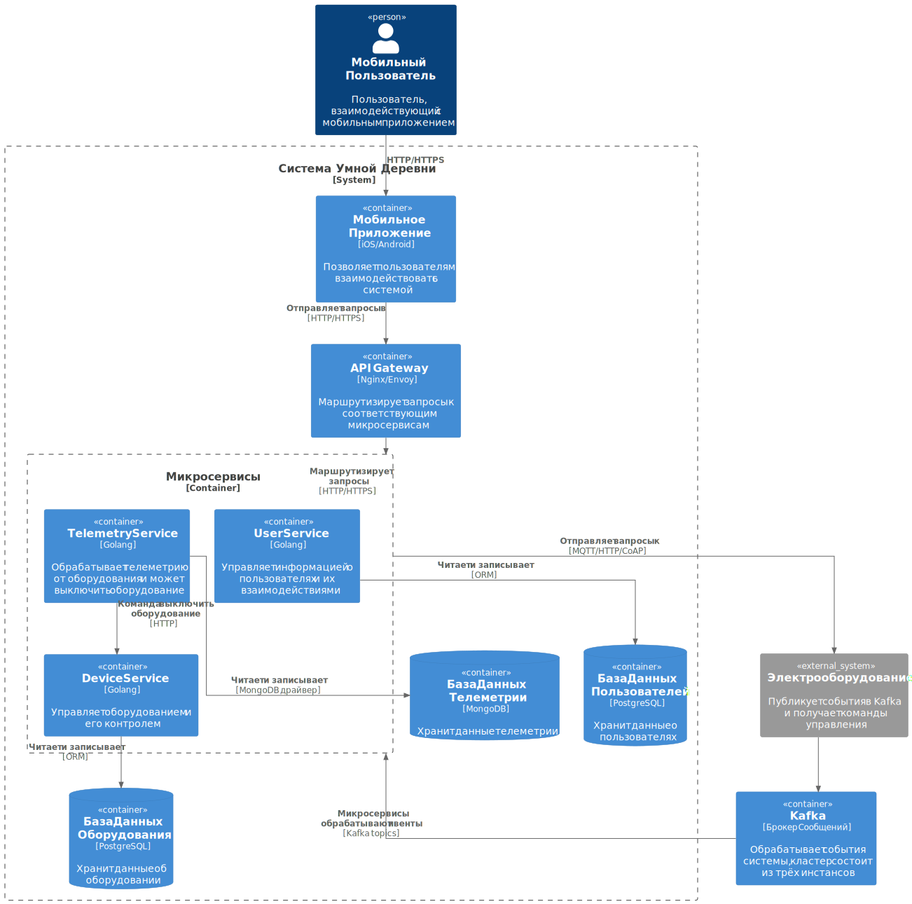

# Table of Contents
- [Project Description](#project-description)
- [Base HTTP Requests](#base-http-requests)
- [C4 Context Diagram](#c4-context-diagram)
- [C4 Container Diagram](#c4-container-diagram)

### Project Description:
The project is a distributed system based on a **microservices architecture** with **Kafka** as the central message broker 
and a **REST API** interface. It includes three primary microservices, each serving a distinct purpose:

- **UserService**: Manages user authentication and login, providing secure access control through JWT.
- **TelemetryService**: Processes telemetry events from IoT devices, including data logging and triggering system-wide actions.
- **DeviceService**: Handles device management, including registering, monitoring, and controlling IoT devices.

The system is designed for scalability and reliability, integrating PostgreSQL for structured data storage 
and MongoDB for unstructured telemetry data. It supports seamless interaction between users and IoT devices through
a user-friendly API and mobile application integration.

The entire system is deployed on **Kubernetes**, ensuring scalability and high availability through container orchestration. 
A Kafka cluster is used to handle inter-service communication, providing fault tolerance and supporting the system's distributed nature.

The project leverages the **Saga pattern** to manage complex distributed transactions, ensuring data consistency across microservices. 
By using a sequence of events and compensating actions, the system can handle failures gracefully while maintaining overall consistency.

### Base HTTP Requests:
#### Start the Project:
```
docker compose up --build
```

#### Register:
```
POST http://0.0.0.0:80/user/register
{
    "username": "new_user",
    "password": "53047"
}
```

#### Login:
```
POST http://0.0.0.0:80/user/login
{
    "username": "new_user",
    "password": "53047"
} + JWT
```

#### Create a House:
```
POST http://0.0.0.0:80/houses
{
    "address": "more test house",
    "square": 23.0
} + JWT
```

#### Get Houses:
```
GET http://0.0.0.0:80/user/houses + JWT
```

#### Get All Modules Provided by the Company (with a slash!):
```
GET http://0.0.0.0:80/device/modules/
```

#### Assign a Module to a House:
```
POST http://0.0.0.0:80/device/modules/houses/5d19d994-12ef-40fc-9569-67bcbc800cfe/modules/15584fb6-d251-43a1-98f7-96c8497b6b43/assign
```

#### Verify a Module is Connected to a House:
```
GET http://0.0.0.0:80/device/modules/houses/5d19d994-12ef-40fc-9569-67bcbc800cfe
```

#### Turn Off a Module:
```
POST http://0.0.0.0:80/device/modules/houses/5d19d994-12ef-40fc-9569-67bcbc800cfe/modules/15584fb6-d251-43a1-98f7-96c8497b6b43/turn-off
```

#### Turn On a Module:
```
POST http://0.0.0.0:80/device/modules/houses/5d19d994-12ef-40fc-9569-67bcbc800cfe/modules/15584fb6-d251-43a1-98f7-96c8497b6b43/turn-on
```

#### Get the Current State of a Module Connected to a House:
```
GET http://0.0.0.0:80/device/modules/houses/5d19d994-12ef-40fc-9569-67bcbc800cfe/modules/8176acb6-b8ca-44a3-8038-3f3b845dc1b6/state
```

#### Connect to the Kafka Broker Container:
```
docker exec -it architecture-sprint-3-kafka1-1 bash
```

#### List All Kafka Topics:
```
kafka-topics.sh --bootstrap-server localhost:9092 --list
```

#### Read an Event in Kafka:
```
kafka-console-consumer.sh --bootstrap-server localhost:9092 --topic equipment.change.state.topic --from-beginning
```

#### Send a Test Event to Kafka in the Telemetry Topic:
```
kafka-console-producer.sh --broker-list localhost:9092 --topic telemetry.data

{"event_type": "TelemetryData", "payload": {"source_id": "sensor_test", "source_type": "sensor", "value": 28.5, "time": 1633036888}}
```

#### Connect to the MongoDB Container:
```
docker exec -it architecture-sprint-3-mongo-1 mongosh -u root -p mongodb --authenticationDatabase admin
```

#### Connect to the Telemetry Database in MongoDB:
```
use telemetry_database
```

#### Retrieve All Events from MongoDB:
```
db.events.find().pretty()
```

#### Generate an .svg Diagram from a .plantuml File:
```
plantuml -tsvg Component_CleverVillageSystem_DeviceService.puml
```

#### Stop and Remove Docker Compose Containers:
```
docker-compose down
```

### C4 Context Diagram


### C4 Container Diagram

