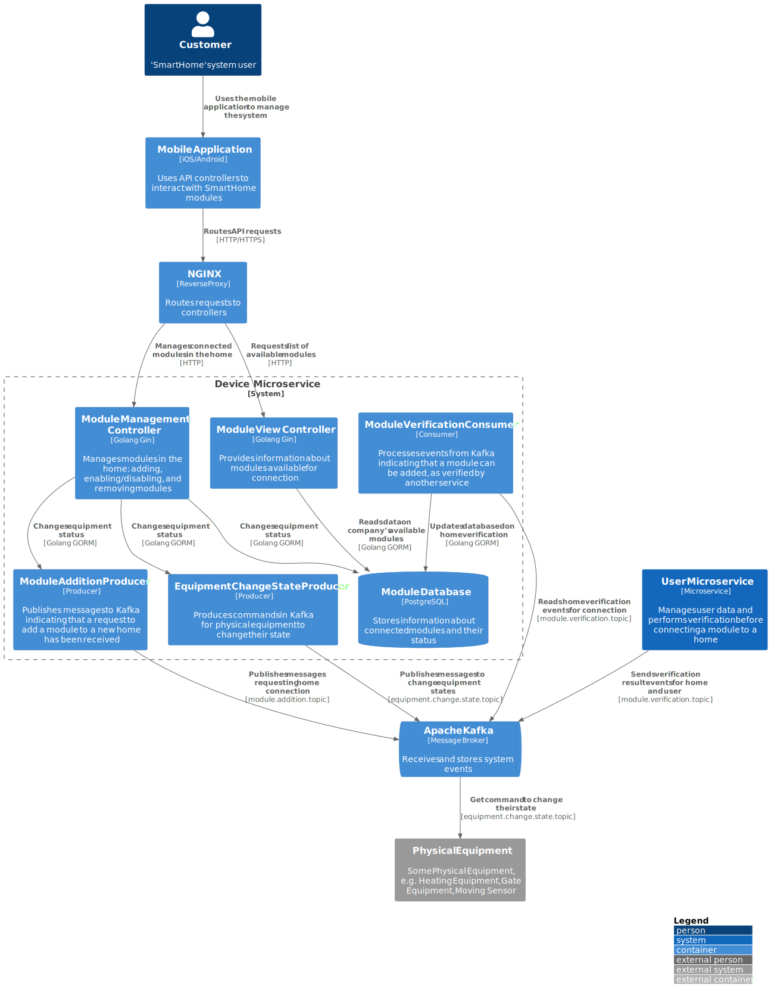

### Сервис для управления модулями умного дома "Smart Home"

Отвечает за отображение всех модулей, доступных для подключения в системе "Smart Home", 
и управление состоянием уже подключённых модулей.

### Логика работы добавления модуля:
1. **Добавление модуля пользователем** <i>POST /modules/houses/:houseID/modules/:moduleID/assign</i>: 
   Пользователь отправляет запрос на ручку добавления модуля в свой дом, API шлюз проксирует запрос в данный микросервис.

2. **Отправка ивента в Kafka**:  
   Сервис отправляет ивент в Kafka для микросервиса пользователей (`UserService`) в топик `module.addition.topic`, 
   тем самым запрашивая возможность установки.

3. **Верификация пользователя**:  
   `UserService` проверяет, может ли пользователь установить данный модуль в свой дом.

4. **Прослушивание ответа верификации**:  
   Сервис слушает топик `module.verification.topic` для получения подтверждения верификации от `UserService`.
    - Если верификация пройдена успешно, создаётся запись в таблице `home_modules` с положительным статусом подключения, 
      подключение успешно.
    - Если верификация не пройдена, в `home_modules` создаётся запись с отрицательным статусом и поделючения не производится.

### Логика управления модулем:
1. **Управление модулем**:  
   После успешного подключения пользователь может отправлять команды в контроллер управления модулями. 
   Например, он может направить запрос на выполнение определённых действий через подключённый модуль 
   на ручку <i>/modules/houses/:houseID/modules/:moduleID/state</i>.

* **Выключить модуль** — это позволяет временно приостановить работу любого подключённого модуля.
```
{
    "homeId": uuid,
    "moduleId": uuid,
    "state": {"running": "off"}
}
```

* **Открыть ворота** — позволяет отдать команду модулю автоматических ворот на открытие.
```
{
    "homeId": uuid,**
    "moduleId": uuid,
    "state": {"gate": "open"}
}
```

- **Увеличить температуру в помещении** — отдаётся команда на повышение температуры.  
  *(Пример: `"state": {"changeTemperature": -5}` — уменьшает температуру на 5 градусов, тем самым охлаждая помещение.)*
```
{
    "homeId": uuid,
    "moduleId": uuid,
    "state": {"changeTemperature": 5}
}
```

* А также **другие команды**, которые могут быть подключены и реализованы в микросервисе для конкретного оборудования.
```
{
    "homeId": uuid,
    "moduleId": uuid,
    "state": ...
}
```

После получения команд для физического оборудования, микросервис `DeviceService` отправляет команды в Kafka 
в топик `equipment.change.state.topic`, из Kafka они доходят до оборудования и оно изменяет своё состояние, 
осуществляя бизнес логику управления от клиента через мобильное приложение.

2. **Отключения модуля**:  
   Помимо временной паузы работы модуля у сервиса `DeviceService` есть ручки для отключения/включения модуля:

   * <i>POST /modules/houses/:houseID/modules/:moduleID/turn-on</i>
   * <i>POST /modules/houses/:houseID/modules/:moduleID/turn-off</i>

После поднятия контейнеров более подробный Swagger доступен по ссылке:
http://0.0.0.0:8080/service/swagger/index.html
 
1. **Получение всех модулей**, модули прописываются в БД во время миграций при запуске Docker контейнера:
<i>GET /modules/</i>

2. **Получение модулей, подключенных к дому**:
<i>GET /modules/houses/:houseID</i>

<i>
также может придти ивент на включение некоторых модулей от сервиса телеметрии, 
например датчик движения может триггеруть систему открыть ворота, выключить котлы, датчик тепла может триггеруть систему
</i>

### C4 Device Service component diagram

