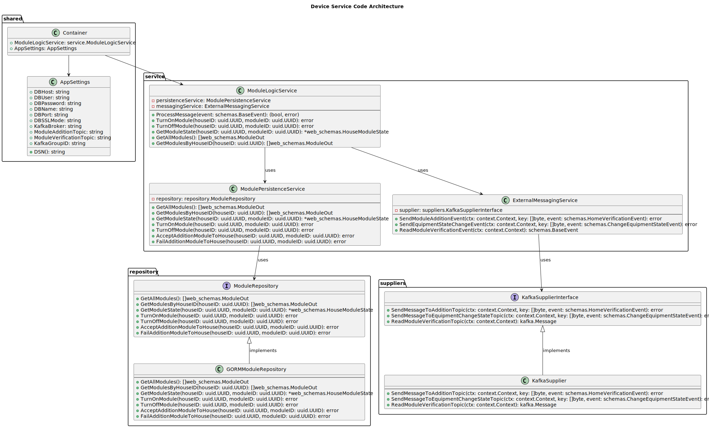

# Table of Contents:
- [Smart Home Module Management Service](#smart-home-module-management-service)
- [Module Addition Logic](#module-addition-logic)
- [Module management logic](#module-management-logic)
- [Logic for retrieving modules](#logic-for-retrieving-modules)
- [C4 Device Service component diagram](#c4-device-service-component-diagram)
- [C4 Device Service code diagram](#c4-device-service-code-diagram)

### Smart Home Module Management Service:
Responsible for displaying all modules available for connection in the "Smart Home" system 
and managing the state of already connected modules.

### Module Addition Logic:
1. **Module addition by the user** <i>POST /modules/houses/:houseID/modules/:moduleID/assign</i>:
   The user sends a request to the module addition endpoint for their home, 
   and the API gateway proxies the request to this microservice.

2. **Sending an event to Kafka**:  
   The service sends an event to Kafka for the user microservice (UserService) in the module.addition.topic, 
   thereby requesting permission for installation..

3. **User verification**:  
   `UserService` checks if the user is allowed to install the module in their home.

4. **Listening for the verification response**:  
   The service listens to the `module.verification.topic` to receive verification confirmation from `UserService`.
    - If verification is successful, a record with a positive connection status is created in the `home_modules` table, and the connection is completed successfully.
    - If verification fails, a record with a negative status is created in `home_modules`, and the module is not connected.

### Module management logic:
1. **Module management**:  
   After a successful connection, the user can send commands to the module management controller. For example, 
   they can send a request to perform specific actions through the connected module via the  
   <i>/modules/houses/:houseID/modules/:moduleID/state</i> endpoint.

   * **Turn off the module** — this allows temporarily pausing the operation of any connected module..
   ```
   {
       "homeId": uuid,
       "moduleId": uuid,
       "state": {"running": "off"}
   }
   ```

   * **Open the gates** — allows sending a command to the automatic gate module to open.
   ```
   {
       "homeId": uuid,
       "moduleId": uuid,
       "state": {"gate": "open"}
   }
   ```

   - **Increase the room temperature** — a command is sent to increase the temperature.  
     *(ex: `"state": {"changeTemperature": -5}` — decreases the temperature by 5 degrees, thereby cooling the room*.
   ```
   {
       "homeId": uuid,
       "moduleId": uuid,
       "state": {"changeTemperature": 5}
   }
   ```

   * As well as **other commands** that can be integrated and implemented in the microservice for specific equipment.
   ```
   {
       "homeId": uuid,
       "moduleId": uuid,
       "state": ...
   }
   ```

   After receiving commands for physical equipment, the `DeviceService` microservice sends commands 
   to Kafka in the `equipment.change.state.topic`. From Kafka, these commands are delivered to the equipment, 
   which then changes its state, executing the business logic for management initiated by the client through the mobile application.

2. **Module deactivation**:  
   In addition to temporarily pausing module operation, the `DeviceService` has endpoints for deactivating/activating a module:

   * <i>POST /modules/houses/:houseID/modules/:moduleID/turn-on</i>
   * <i>POST /modules/houses/:houseID/modules/:moduleID/turn-off</i>

### Logic for retrieving modules:
   1. **Retrieving all modules**, modules are registered in the database during migrations when the Docker container is started:
   <i>GET /modules/</i>

   2. **Retrieving modules connected to a home**:
   <i>GET /modules/houses/:houseID</i>

### Logic for executing equipment commands from the telemetry service:
The service may receive an event from the telemetry service `(TelemetryService)`. 
For example, a motion sensor might trigger the system to open the gates, or it could be useful 
for automatically turning off boilers when temperature sensor readings are too high. 
The event schema for changing equipment state based on a request from the telemetry service is similar to the schema used 
for changing equipment state based on a user request.

Note: After starting the containers, a more detailed Swagger is available at the following link:
http://0.0.0.0:8080/service/swagger/index.html </b>

### C4 Device Service component diagram:


### C4 Device Service code diagram:

