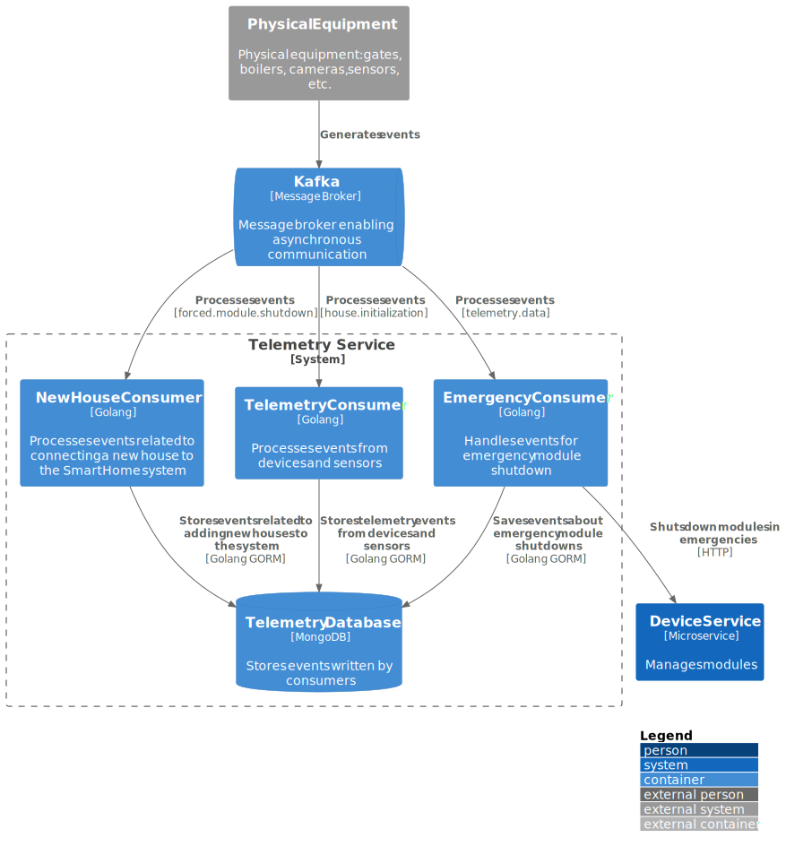

# Table of Contents:
- [Telemetry service for receiving events from equipment](#telemetry-service-for-receiving-events-from-equipment)
- [Logic for processing emergency module shutdown events](#logic-for-processing-emergency-module-shutdown-events)
- [Logic for processing events of connecting a new home to the system](#logic-for-processing-events-of-connecting-a-new-home-to-the-system)
- [Logic for processing telemetry events](#logic-for-processing-telemetry-events)
- [C4 Telemetry Service component diagram](#c4-telemetry-service-component-diagram)
- [C4 Telemetry Service code diagram](#c4-telemetry-service-code-diagram)

### Telemetry service for receiving events from equipment:
The telemetry service is responsible for processing events from equipment and sensors, 
as well as interacting with `DeviceService` via HTTP to manage devices.

### Logic for processing emergency module shutdown events:
1. **Emergency situation**: During equipment operation, predefined situations may occur, such as overheating, excessively high or low temperatures, module malfunctions, etc.
2. **Receiving an emergency shutdown event**: When an emergency event is published to the corresponding topic, the telemetry service sends an HTTP request to DeviceService to initiate the emergency shutdown of the equipment.
3. **Saving the event**: Events related to emergency module shutdowns are stored in MongoDB for further analysis and auditing.

### Logic for processing events of connecting a new home to the system:
1. **Connecting a new home to the system**: When setting up a new home to work with the smart home system, the equipment service sends an event to Kafka. This allows the telemetry service to account for the new connection.
2. **Event saving**: events about connecting a new home are stored in MongoDB to update the system's state.  

### Logic for processing telemetry events:
1. **Event generation**: during system operation, all equipment in users' homes sends telemetry data to Kafka, recording its current state and performance.
2. **Event saving**: telemetry events are stored in MongoDB for subsequent monitoring and analysis.

### C4 Telemetry Service component diagram:

### C4 Telemetry Service code diagram:

